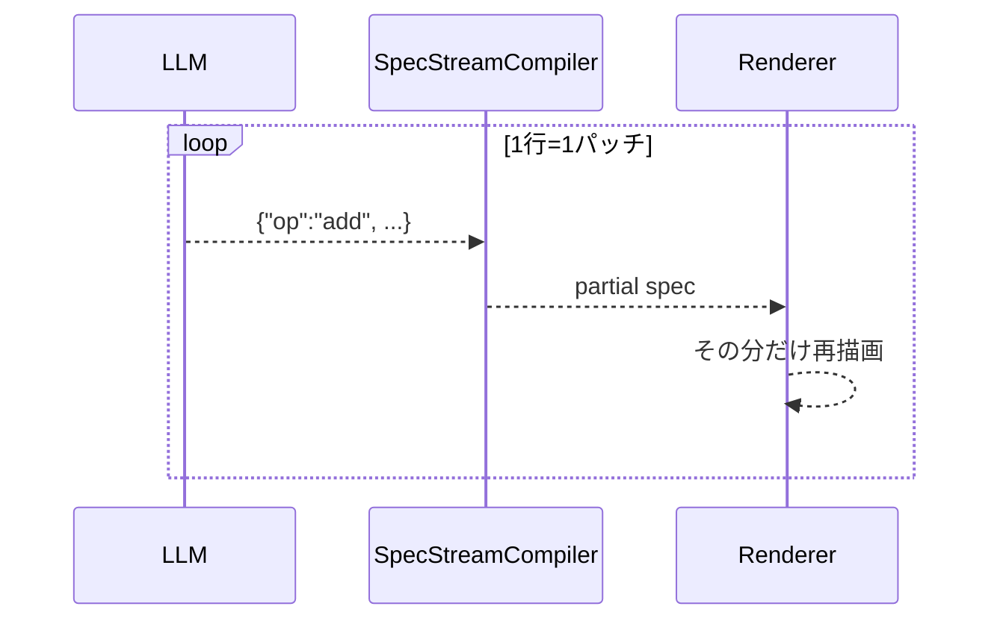

# json-render の逐次描画は<br>どうなっているのか？

<div>
  <span class="cover-sub">〜 A2UI と比較する 〜</span>
</div>
<div>
  <span class="cover-eyebrow">Nihonbashi.js #10 ・ 2026.07.08</span>
  <span class="cover-by">@daitasu</span>
</div>

---
layout: intro
---

<div class="flex items-center gap-12">
  <div>
    
    <div class="mt-3 flex flex-col items-center">
      <p>X</p>
      
    </div>
  </div>
  <div class="text-xl space-y-2">
    <h2 class="!text-2xl">自己紹介</h2>
    <div>
      <p>Name:</p>
      <p class="ml-3">@daitasu</p>
    </div>
    <div>
      <p>Belong to:</p>
      <p class="ml-3">コミューン株式会社</p>
    </div>
    <div>
      <p>Favorite:</p>
      <p class="ml-3">TypeScript, Sauna, Dinosaurs</p>
    </div>
    <div>
      <p>Community:</p>
      <p class="ml-3">Tachikawa.any</p>
    </div>
  </div>
</div>

---

# 今日話すこと

<div class="mt-8 text-xl">

- **Generative UI** … LLM がその場で UI を組み立てて返す
- **json-render の逐次描画** … なぜ UI が「じわじわ生えて」くるのか
  - RFC 6902 の JSON Patch を 1 行ずつストリームしている
- **A2UI と比較** … 同じ「UI を喋る」でも“生え方”が違う
  - 差の正体は思想ではなく **ストリームの最小単位の粒度**

</div>

<MessageBox>コードは実際に触って確かめた小さな検証アプリがベース</MessageBox>

---
layout: section
---

# 題材：LLM に「今日の天気は？」

---

# Generative UI ってなに？

<div class="mt-6 text-lg">

- LLM が**その場で UI を生成**して返す。ボタンやカードの JSON を喋る
- 前提として、フレームワーク側が **catalog（AI に見せる部品カタログ）** を持つ
  - `WeatherWidget` / `Text` / `Stack` … 「使っていい部品と props」の契約
- LLM は catalog の語彙だけで**構造を組み立てて**ストリームで返す
- 今日はこの返り方を **json-render** と **A2UI** で比べる

</div>

<div class="mt-6 text-base color-gray">

題材は共通で「今日の天気は？」→ 天気カード＋週間予報を組む、というやりとり。

</div>

---
layout: section
---

# json-render の逐次描画

---

# json-render の登場人物

<div class="mt-6 text-lg">

- **catalog** … `defineCatalog()`。LLM に見せる部品と props の契約
  - `catalog.prompt()` でシステムプロンプトを自動生成
- **サーバ** … LLM の出力（JSONL）を `text/plain` でそのままストリーム
- **クライアント** … `SpecStreamCompiler` が受信しながら spec を組み立て
- **Renderer**（`"use client"`）… spec を registry の React 部品で描画

</div>

<div class="mt-5 text-base color-gray">

肝は「サーバは 1 行ずつ流すだけ」「クライアントは届いた分だけ描く」。

</div>

---

# サーバは JSON Patch を 1 行ずつ流す

<div class="mt-2 text-base">

ワイヤ形式は **RFC 6902（JSON Patch）の JSONL**。1 行 = 1 オペレーション。

```json
{"op":"add","path":"/root","value":"main"}
{"op":"add","path":"/elements/main","value":{"type":"Stack","props":{"direction":"column"},"children":[]}}
{"op":"add","path":"/elements/widget","value":{"type":"WeatherWidget","props":{"city":"東京","temperature":22,"condition":"sunny"},"children":[]}}
{"op":"add","path":"/elements/main/children/-","value":"widget"}
```

- `path` を少しずつ深くしながら **`add` を積む**だけ
- LLM がトークンを吐くそばから `res.write` → 1 行完成するたび届く

</div>

<style>
.slidev-code, .slidev-code * { font-size: 11px !important; line-height: 1.55 !important; }
</style>

---

# クライアントは届いた分だけ spec に積む

<div class="mt-2 text-base">

```ts
const compiler = createSpecStreamCompiler<Spec>({ elements: {} });
for (;;) {
  const { done, value } = await reader.read();
  if (done) break;
  // 完成した JSONL 行だけをパッチ化して spec に適用
  const { result, newPatches } = compiler.push(decoder.decode(value));
  if (newPatches.length > 0) setSpec(result); // ← 差分が出たら再レンダー
}
```

- `compiler.push()` がチャンク境界を吸収し、**完成した行だけ**を適用
- 新しいパッチが出たら `setState` → **React 再レンダー**
- partial spec を許容：`root` と実体が揃った瞬間から描き始める

</div>

<style>
.slidev-code, .slidev-code * { font-size: 12px !important; line-height: 1.55 !important; }
</style>

---

# だから「じわじわ生える」

<div class="mt-4 text-base">

`add` パッチを上から適用すると、画面はこの順で育つ：

| パッチ | 画面の変化 |
|--------|-----------|
| `add /elements/main = Stack([])` | **空の縦スタックが出現** |
| `add /elements/widget = WeatherWidget` | 実体だけ用意（まだ親に未接続） |
| `add /elements/main/children/- = "widget"` | **天気カードが Stack に生える** |

</div>

<div class="mt-4 text-lg">

- **「実体の追加」と「children への参照追加」が別パッチ**
- だから *箱 → 中身* の順で、1 ノードずつ積み上がる

</div>

---
layout: two-cols
---

# json-render の流れ

::left::

<div class="text-sm mt-2">

- catalog を prompt 化して LLM に提示
- LLM は JSON Patch(JSONL) をストリーム
- compiler が spec に逐次適用
- パッチごとに再レンダー＝**ノード単位で生える**

</div>

::right::



<div class="text-xs color-gray mt-2">

全パッチが揃うのを待たない。ここが“逐次描画”。

</div>

---
layout: default
---

# 実演：UI が生えてくる

<div class="max-w-4xl mx-auto">
  <DemoFrame src="http://localhost:5211/" height="360px" label="json-render weather (localhost:5211)" class="mt-2" />
</div>

<div class="mt-3 text-sm color-gray text-center">

「東京の天気は？」→ Stack → カード → 区切り → 週間予報… と節ごとに積み上がる

</div>

---
layout: section
---

# A2UI と比較する

---

# A2UI とは

<div class="mt-6 text-lg">

- agent が **“UI を喋る” プロトコル**（Agent-to-UI）
- やりとりは**メッセージ単位**。主に 3 種：
  - `createSurface` … 描画面をつくる
  - `updateComponents` … **コンポーネントツリー（構造）**を送る
  - `updateDataModel` … **データ**を送る
- Client 側が schema を内省して `path` を data model に **subscribe**

</div>

<div class="mt-5 text-base color-gray">

json-render と違い、**構造とデータが別メッセージ**で届く。

</div>

---

# A2UI のメッセージ列

<div class="mt-2 text-base">

```json
{"createSurface":{"surfaceId":"s1","catalogId":".../catalog.json"}}
{"updateDataModel":{"surfaceId":"s1","path":"/","value":{"summary":"晴れ時々くもり"}}}
{"updateComponents":{"surfaceId":"s1","components":[
  {"id":"root","component":"Column","children":["summary","widget","forecast"]},
  {"id":"summary","component":"Text","text":{"path":"/summary"}},
  {"id":"widget","component":"WeatherWidget","city":"東京","temperature":22,"condition":"sunny"},
  {"id":"forecast","component":"WeeklyForecastList","days":[ /* ...7日分... */ ]}
]}}
```

- `updateComponents` は **ツリー全体を 1 メッセージ**に flat で同梱
- データは `updateDataModel` で先に一括投入、`path` で束縛

</div>

<style>
.slidev-code, .slidev-code * { font-size: 10.5px !important; line-height: 1.5 !important; }
</style>

---

# 比較①：“生え方”の差の正体

<div class="mt-4 text-lg">

思想の差ではなく、**ストリームの最小単位の粒度**の差。

</div>

<div class="mt-4 text-base">

| | json-render | A2UI |
|---|---|---|
| ストリームの 1 単位 | **1 パッチ = 1 ノード**（極小・大量） | **1 メッセージ**（ツリー全体を同梱しうる） |
| 描画のされ方 | パッチ適用ごとに **node 単位で生える** | メッセージ到着で **まとめて描画** |
| 構造とデータ | 同じ spec に同梱（state 内包） | `updateComponents` と `updateDataModel` に分離 |

</div>

<div class="mt-4 text-base color-gray">

※ A2UI も `updateComponents` を分割送信すれば細かく生やせる。逆に json-render も 1 チャンクで送れば一気に出る。

</div>

---
layout: two-cols
---

# 比較②：受信オペレーションを可視化

::left::

<div class="text-xs mt-2">

**json-render** — 極小パッチが大量

```json
{"op":"add","path":"/root",...}
{"op":"add","path":"/elements/main",...}
{"op":"add","path":"/elements/summary",...}
{"op":"add","path":".../children/-",...}
{"op":"add","path":"/elements/widget",...}
{"op":"add","path":".../children/-",...}
… (十数行つづく)
```

</div>

::right::

<div class="text-xs mt-2">

**A2UI** — 巨大メッセージが数発

```json
{"createSurface":{...}}
{"updateDataModel":{...}}
{"updateComponents":{"components":[
   /* ツリー全体がここに丸ごと */
]}}
```

</div>

<div class="text-sm color-gray mt-4 col-span-2">

検証アプリのチャット右側に「受信した操作」を到着順で積むログを付けた → 粒度差が一目で分かる。

</div>

---

# 比較③：データ束縛と live 更新

<div class="mt-4 text-base">

| | json-render | A2UI |
|---|---|---|
| prop の束縛 | `{"$state":"/weather/condition"}` | `{"path":"/weather/condition"}` |
| テンプレート | `{"$template":"最高 ${/weather/high}°"}` | data model 側で組む |
| 双方向 | `{"$bindState":"/favorite"}` | data model への write-back |
| データの確定 | **生成時スナップショット**（AI が state に焼く） | `updateDataModel` **再送で更新**（live に強い） |

</div>

<div class="mt-5 text-lg">

- json-render = 手軽。ただしデータは生成した瞬間の値で固定
- A2UI = 2 チャネルの配管は要るが、後から `updateDataModel` で貼り替え可

</div>

---
layout: section
---

# まとめ

---

# まとめ

<div class="mt-6 text-lg">

- json-render の逐次描画 = **RFC 6902 の `add` を 1 行ずつ適用して spec を育てる**
  - 「実体追加」と「children 参照追加」が別パッチ → *箱 → 中身* で生える
- A2UI は **メッセージ単位**（createSurface / updateComponents / updateDataModel）
  - 構造とデータを別チャネルで送る
- “生え方”の違いは思想ではなく **ストリームの最小単位の粒度**
- データ束縛は両者とも `path`/`$state`。**live 更新は A2UI が一歩リード**

</div>

<MessageBox>結局は「どの粒度で、どの面がデータを持つか」の設計選択</MessageBox>
