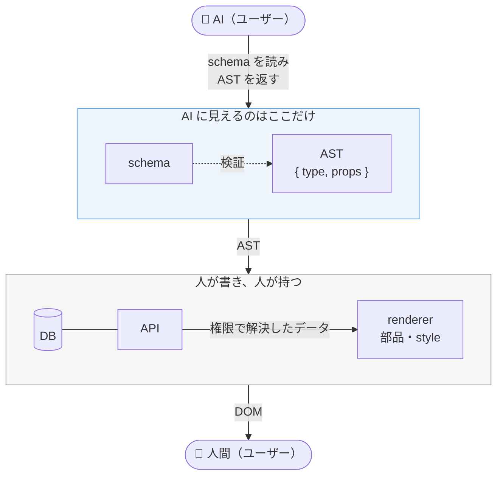

# AI がユーザーになる時代の<br>フロントエンドの<br>システム境界を考える
<p class="cover-sub">~ Generative UI に共通する設計思想 ~</p>
<div>
  <span class="cover-eyebrow">フロントエンドカンファレンス関西 2026 ・ 2026.10.12</span>
  <span class="cover-by">@daitasu</span>
</div>

<style>
:global(.slidev-layout.cover .dino-img) {
  height: 18rem !important;
  width: 18rem;
  bottom: 1.5rem !important;
  right: 1.5rem !important;
  border-radius: 50%;
  object-fit: cover;
}
.cover-sub { margin-top: 0.5rem; font-size: 1.1rem; color: var(--dt-text-muted); }
</style>

---
layout: intro
---

<div class="flex items-center gap-12">
  <div>
    
    <div class="mt-3 flex gap-3 items-end justify-center">
      <div class="flex flex-col items-center">
        <p>X</p>
        
      </div>
      <div class="flex flex-col items-center">
        <p>Tachikawa.any</p>
        
      </div>
    </div>
  </div>
  <div class="text-xl space-y-1.5">
    <h2 class="!text-2xl">自己紹介</h2>
    <div>
      <p>Name:</p>
      <p class="ml-3">@daitasu</p>
    </div>
    <div>
      <p>Belong to:</p>
      <p class="ml-3">コミューン株式会社</p>
    </div>
    <div>
      <p>Favorite:</p>
      <p class="ml-3">TypeScript, Onsen, Dinosaurs</p>
    </div>
    <div>
      <p>Career:</p>
      <p class="ml-3">SIer(2年)→ Frontend (3年) → EM (4年) → IC</p>
    </div>
    <div>
      <p>Community:</p>
      <a class="ml-3" href="https://tachikawaany.connpass.com/" target="_blank">
        Tachikawa.any
      </a>
      <a class="ml-3" href="https://gotanda--ts.connpass.com/event/402821/" target="_blank">
        五反田.ts
      </a>
    </div>
  </div>
</div>

---
layout: two-cols
---

# Generative UI ってなに？

::left::

<div class="mt-4 text-lg">

- LLM が**その場で UI を生成**して返すアプローチ
- 返答が「文章」ではなく、**ボタン・カード・フォーム**そのものになる
- 「今日の天気は？」→ テキストの説明ではなく**天気カード**が返ってくる
- ユーザーは読むだけでなく、返ってきた UI を**そのまま操作**できる

</div>

::right::

<div class="mt-8 flex justify-center">
  
</div>

---

# とはいえ、Generative UI には悩みもある

<div class="mt-8 text-xl">

- 生成される UI は**掛け捨て前提**
  - 会話ごとに生まれて、会話ごとに消える
- 業務アプリケーションにおいては、**安定しない UI はリスクが高い**
  - 描画時点では**確立された UI** が出される方が安心
- しかし、ユーザーが **AIで**、**自分で**UIを組み立てられる仕組みは魅力的
  - ノーコードツールの中間構築をAIが担う

</div>

---
layout: section
---

# Generative UI の<span class="accent">仕組みだけ</span>、<br>うまく使えないだろうか？

<div class="mt-10 text-lg text-center color-gray">
  Vercel Labs の <b>json-render</b>を例に、処理を見ていく
</div>

---
layout: two-cols
---

# json-render はどうやっている？

::left::

<div class="mt-6 text-lg space-y-5">
  <div class="howto-step active">① カタログを定義する</div>
  <div class="howto-step">② 実態（コンポーネント）を定義する</div>
  <div class="howto-step">③ カタログからシステムプロンプトを生成</div>
</div>

::right::

```ts
import { defineCatalog } from "@json-render/core";
import { z } from "zod";

export const catalog = defineCatalog({
  components: {
    Stack: {
      props: z.object({
        direction: z.enum(["row", "column"]),
      }),
      hasChildren: true,
    },
    WeatherWidget: {
      props: z.object({
        city: z.string(),
        temperature: z.number(),
        condition: z.string(),
      }),
    },
  },
});
```

<style>
.howto-step { opacity: 0.35; }
.howto-step.active { opacity: 1; font-weight: 700; }
.slidev-code, .slidev-code * { font-size: 11px !important; line-height: 1.5 !important; }
</style>

---
layout: two-cols
---

# json-render はどうやっている？

::left::

<div class="mt-6 text-lg space-y-5">
  <div class="howto-step">① カタログを定義する</div>
  <div class="howto-step active">② 実態（コンポーネント）を定義する</div>
  <div class="howto-step">③ カタログからシステムプロンプトを生成</div>
</div>

::right::

```tsx
import { defineRegistry } from "@json-render/react";
import { catalog } from "./catalog";

export const { registry } = defineRegistry(catalog, {
  components: {
    Stack: ({ props, children }) => (
      <div
        className={
          props.direction === "row"
            ? "flex flex-row gap-2"
            : "flex flex-col gap-2"
        }
      >
        {children}
      </div>
    ),
    WeatherWidget: ({ props }) => (
      <WeatherCard
        city={props.city}
        temperature={props.temperature}
        condition={props.condition}
      />
    ),
  },
});
```

<style>
.howto-step { opacity: 0.35; }
.howto-step.active { opacity: 1; font-weight: 700; }
.slidev-code, .slidev-code * { font-size: 10px !important; line-height: 1.4 !important; }
</style>

---
layout: two-cols
---

# json-render はどうやっている？

::left::

<div class="mt-6 text-lg space-y-5">
  <div class="howto-step">① カタログを定義する</div>
  <div class="howto-step">② 実態（コンポーネント）を定義する</div>
  <div class="howto-step active">③ カタログからシステムプロンプトを生成</div>
</div>

::right::

```ts
const systemPrompt = catalog.prompt();

const result = streamText({
  model: anthropic("claude-haiku-4-5"),
  system: systemPrompt,
  prompt,
});
```

<div class="text-sm color-gray mt-4">

catalog の「使っていい部品と props」が、そのまま LLM への契約になる。

</div>

<style>
.howto-step { opacity: 0.35; }
.howto-step.active { opacity: 1; font-weight: 700; }
.slidev-code, .slidev-code * { font-size: 12px !important; line-height: 1.55 !important; }
</style>

---

# つまり、

<div class="flex items-stretch justify-center gap-3 mt-10">
  <div class="step-card">
    <div class="step-no">1</div>
    <div class="step-title">契約をつくる</div>
    <div class="step-body">AI が利用可能な<b>特定パーツと規約</b>（catalog）を人間が作成する</div>
  </div>
  <div class="step-arrow">→</div>
  <div class="step-card">
    <div class="step-no">2</div>
    <div class="step-title">AI が組み立てる</div>
    <div class="step-body">それを元に、AI は HTML ではなく <b>JSON 構造</b>（spec）を組み立てる</div>
  </div>
  <div class="step-arrow">→</div>
  <div class="step-card">
    <div class="step-no">3</div>
    <div class="step-title">描画関数が描く</div>
    <div class="step-body">描画関数が<b>フレームワークに合わせて</b>、JSON を実際の UI に再描画する</div>
  </div>
</div>

<div class="mt-10 text-lg text-center color-gray">
  AI が触るのは <b>JSON</b> だけ。HTML / CSS / コンポーネント実体には一切触れない。
</div>

<style>
.step-card { flex: 1; max-width: 260px; padding: 1.2rem 1.3rem; border-radius: 14px; background: #f6f8fc; border: 1.5px solid rgba(74, 144, 217, 0.25); box-shadow: 0 16px 36px -22px rgba(30, 64, 128, 0.34); }
.step-no { width: 2rem; height: 2rem; border-radius: 999px; background: #4a90d9; color: #fff; font-weight: 700; display: flex; align-items: center; justify-content: center; }
.step-title { margin-top: 0.7rem; font-size: 1.15rem; font-weight: 700; }
.step-body { margin-top: 0.5rem; font-size: 0.95rem; line-height: 1.6; color: #4b5563; }
.step-arrow { align-self: center; font-size: 2rem; color: #4a90d9; font-weight: 700; }
</style>

---

# なんかこれ、<span class="accent">抽象構文木（AST）</span>っぽい

<div class="mt-2 text-base">

「AI が使ってよいノード」の Union として UI を型定義し、AI にはこの木を返させる。

</div>

```ts
type NodeBlock = TextNode | ButtonNode | PriceNode;
```

<div class="grid grid-cols-3 gap-3 mt-1">
<div>

```ts
type TextNode = {
  type: "text";
  props: {
    content: string;
    size: "sm" | "md" | "lg";
    weight: "normal" | "bold";
  };
};
```

</div>
<div>

```ts
type ButtonNode = {
  type: "button";
  props: {
    label: string;
    variant: "primary" | "secondary";
    action: "submit" | "cancel";
  };
};
```

</div>
<div>

```ts
type PriceNode = {
  type: "price";
  props: {
    amount: number;
    currency: "JPY" | "USD";
    showTax: boolean;
  };
};
```

</div>
</div>

<div class="mt-2 text-sm color-gray">

- `type` が **AI に許可した語彙**、`props` が **AI に許可した値の範囲**。自由な HTML はどこにも出てこない
- 木（JSON）を保存しておけば、描画先は React でも Vue でもメールでも選べる

</div>

<style>
.slidev-code, .slidev-code * { font-size: 9.5px !important; line-height: 1.5 !important; }
</style>

---

# この木を軸に、システム境界を引く

<div class="grid grid-cols-[2fr_3fr] gap-6 mt-2">
<div>

```txt
packages/
├─ schema/    AST の型（Zod）
│             React もドメインも知らない
├─ agent/     schema だけを AI に渡し
│             AST を返させる
├─ renderer/  AST → DOM の写像
│             部品の実体と style はここ
└─ api/       DB を閉じ込め、
              閲覧者の権限でデータを解決
apps/
└─ web/       人間が見る画面
```

<div class="mt-3 text-xs space-y-1">
  <p>🤖 AI が知るのは <b>schema だけ</b>。ドメイン知識も style も持たない</p>
  <p>🔒 DB には触れない。データは <b>API 経由</b>で権限つきで解決</p>
  <p>🧑 人間は AST から<b>写像された DOM</b> を見る</p>
</div>

</div>
<div>



</div>
</div>

<div class="mt-1 text-sm text-center color-gray">
  AST に入るのは <code>type</code> と <code>props</code> だけ。値の真実は API が権限つきで解決する
</div>

<style>
.slidev-code, .slidev-code * { font-size: 10.5px !important; line-height: 1.45 !important; }
</style>

---

# そして先月、<span class="accent">Jev</span> が登場した

<div class="mt-2 text-base">

TypeSafe AI が 2026/09/15 に公開した「**System One モデル**」。文章を書かず、**判断だけ**を返す。

</div>

<div class="grid grid-cols-2 gap-5 mt-3">
  <div class="model-card">
    <div class="model-title">これまでの LLM</div>
    <ul>
      <li>トークンを<b>逐次生成</b>する</li>
      <li>UI も <b>ストリーミングで少しずつ</b>描く</li>
      <li>応答は秒単位</li>
    </ul>
  </div>
  <div class="model-card active">
    <div class="model-title">Jev（System One）</div>
    <ul>
      <li>型付きの問いに、<b>型付きの判断</b>を一度に返す</li>
      <li>決められた選択肢から<b>選ぶだけ</b></li>
      <li>応答は 0.1 秒前後（公称）</li>
    </ul>
  </div>
</div>

<div class="mt-4 text-base">

- schema の中から `type` と `props` を選ぶのは、まさに**型付きの判断**
- 組み合わせれば、Generative UI は**逐次描画すら要らなくなる**
- UI を**リアルタイムに書き換えていく**プロダクトが、現実味を帯びてきた

</div>

<style>
.model-card { padding: 0.7rem 1.2rem; border-radius: 14px; background: #f6f8fc; border: 1.5px solid rgba(74, 144, 217, 0.2); font-size: 0.95rem; }
.model-card.active { border-color: #4a90d9; box-shadow: 0 16px 36px -22px rgba(30, 64, 128, 0.34); }
.model-title { font-weight: 700; font-size: 1.1rem; margin-bottom: 0.4rem; }
.model-card ul { margin: 0; padding-left: 1.2rem; }
</style>

---

# まとめ

<div class="mt-6 text-lg">

- Generative UI の仕組みは、**契約 → AST → 描画** に分解できる
  - catalog（schema）で AI に許す語彙を決め、AI は木を返し、描画関数が UI にする
- AI も**ユーザーの一人**として、境界の外側に置く
  - AI に渡すのは schema だけ。ドメイン知識・style・DB は渡さない
  - データは API が権限つきで解決し、人間は AST から写像された DOM を見る
- 判断特化の高速モデルで、**UI をリアルタイムに組み替える**時代が近づいている
- これからのフロントエンドの責務は、**「AI に何を許すか」を schema として書き下すこと**

</div>
